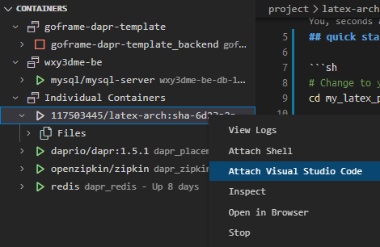

# latex-arch

LaTeX Docker image based on Arch Linux. 

Nightly build based on Github Action.

## pull image

`docker pull 117503445/latex-arch:main`

Chinese user can refer to <https://wiki.117503445.top/op/Docker%20%E5%B8%B8%E7%94%A8%E6%93%8D%E4%BD%9C/>.

## quick start

```sh
# Change to your project
cd my_latex_project

# run 'latexmk' command
docker run -it --rm -v ${PWD}:/root/data 117503445/latex-arch:main latexmk

# run 'xelatex main.tex' command
docker run -it --rm -v ${PWD}:/root/data 117503445/latex-arch:main xelatex main.tex

# optional: custom font
docker run -it --rm -v ${PWD}:/root/data -v ${PWD}/fonts:/usr/share/fonts 117503445/latex-arch:main latexmk
```

## VS Code (recommend)

1. run LaTeX Docker Container

```sh
# Change to your project
cd my_latex_project

docker run -d -it -v ${PWD}:/root/data -v ${PWD}/fonts:/usr/share/fonts 117503445/latex-arch:main
```

2. VS Code install Docker extension <https://code.visualstudio.com/docs/containers/overview>

3. Attach Shell



4. install [LaTeX](https://marketplace.visualstudio.com/items?itemName=mathematic.vscode-latex) (not LaTeX Workshop !!!!) and [vscode-pdf](https://marketplace.visualstudio.com/items?itemName=tomoki1207.pdf) extension in Docker Container.

5. Enjoy :)
